<h1 align="center"> SmartHome-Door </h1>

  

# High-Level Design

  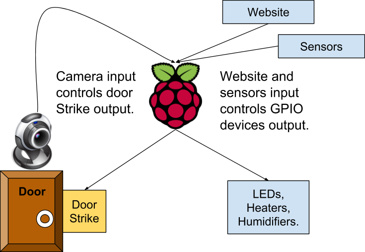
  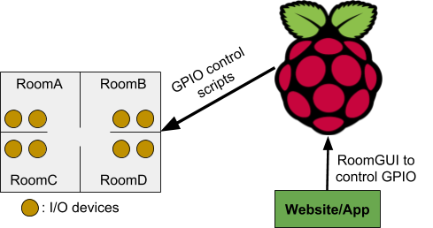

# :camera: Sneak Peak
### :post_office: Smart Home Prototype:

  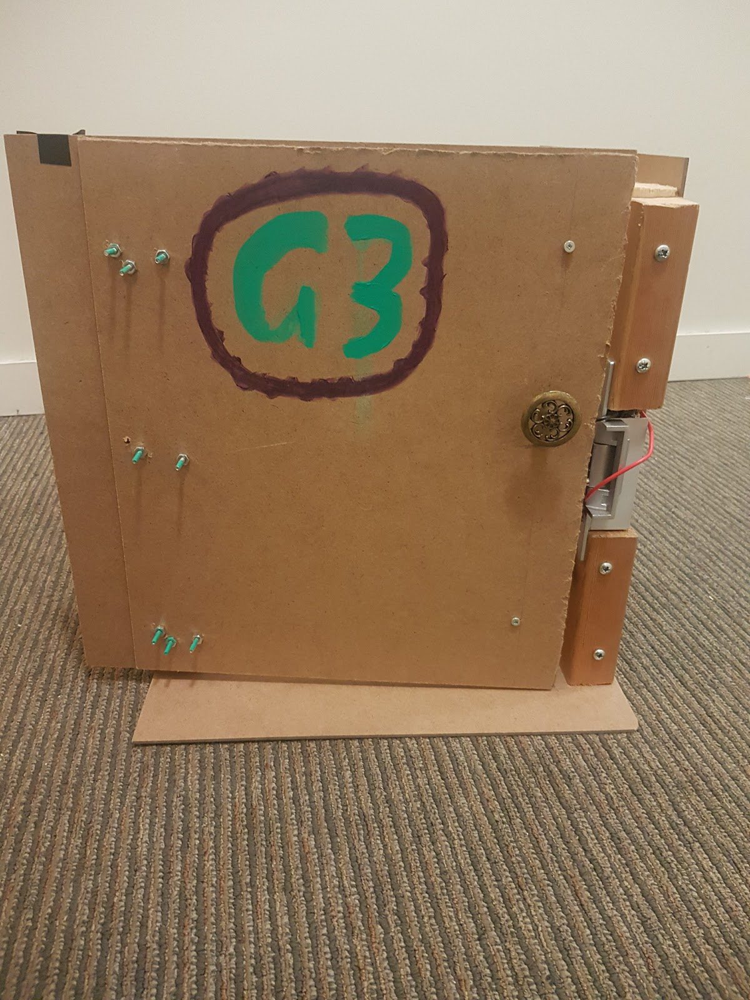
  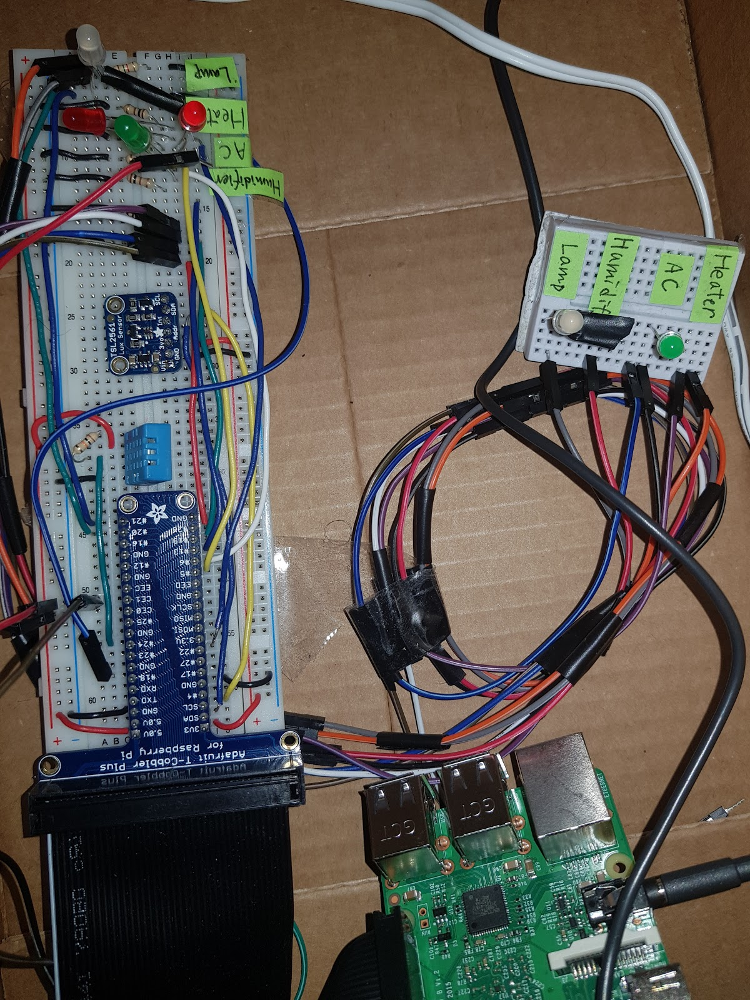

 
### :hushed: Facial Recognition

  

  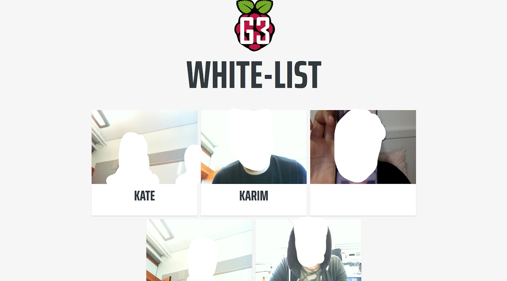
    <em>image_caption</em>
   
 
  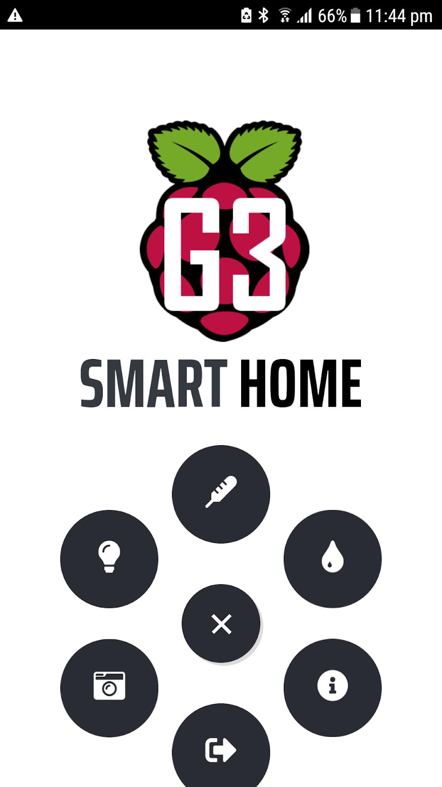

 

### :iphone: Mobile App:

  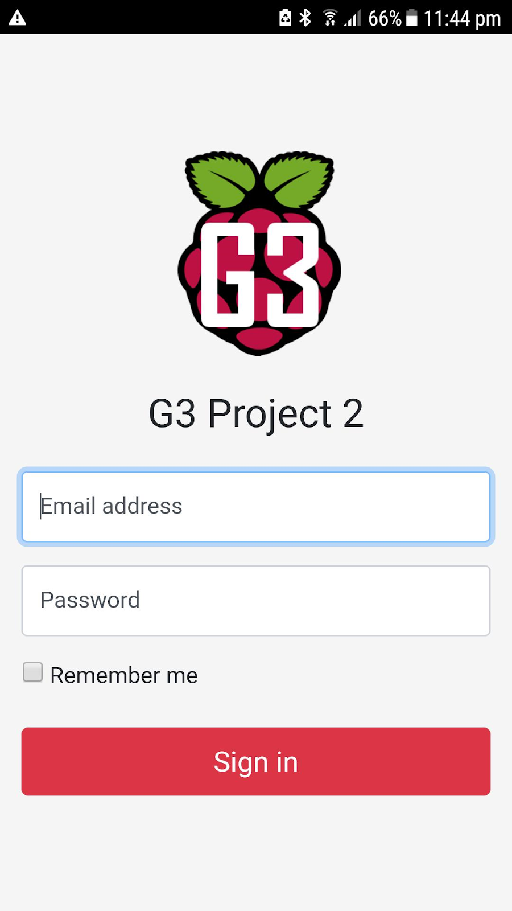
  
  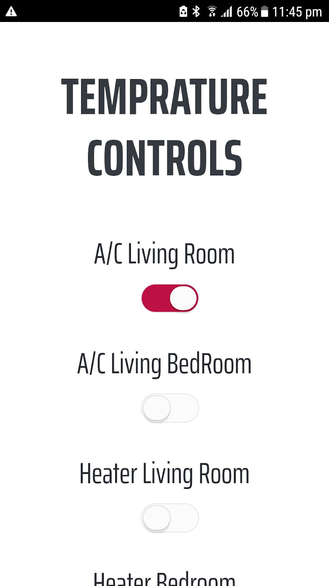
  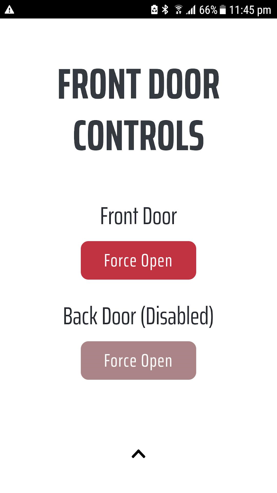 

 

### :globe_with_meridians: Web App:

  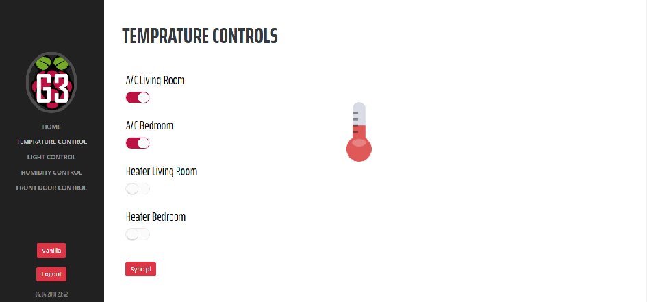
  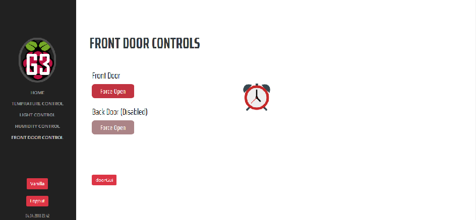

 

